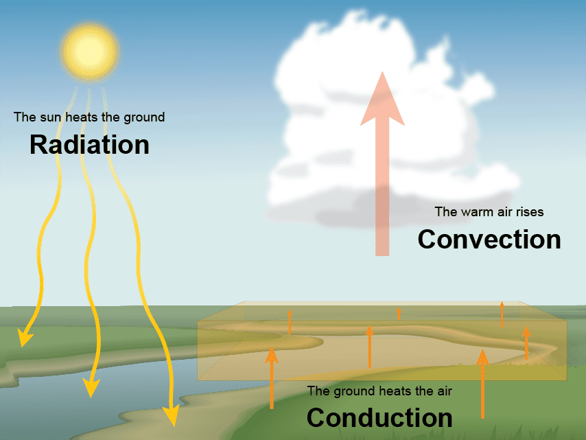
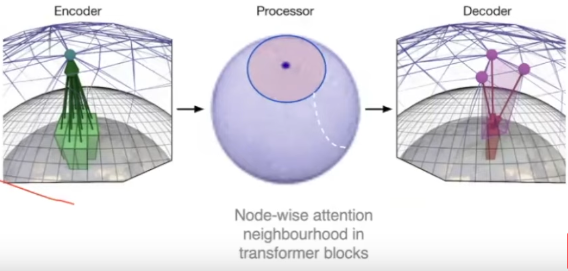
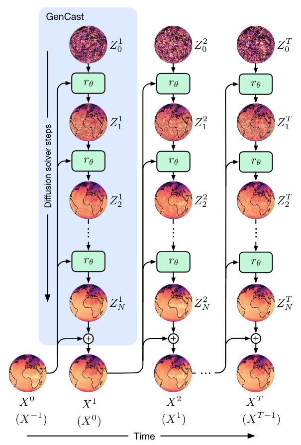
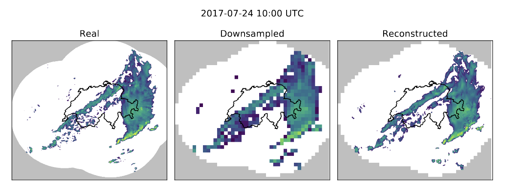

# Increasing the resolution of GenCast's probabilistic weather forecasting: HRGenCast

## Overview
Machine Learning Weather Prediction (MLWP) has emerged as a promising alternative to Numerical Weather Prediction practices commonly used by forecasting entities globally. GenCast is one such model for global weather prediction at a 12 hour, 0.25 (~30km) spatiotemporal resolution. Consisting of the combination of graph-transformer architecture and a conditional diffusion model, GenCast is able to efficiently make probabilistic predictions of future weather. While these capabilities are impressive, there is room for improvement in the resolution of the model. In its current state, GenCast cannot forecast mesoscale phenomena such as thunderstorms, supercells, or squall-lines. These weather events frequently cause large amounts of damage to local communities, infrastructure, and environments. 

This project aims to improve the spatial resolution of GenCast down to kilometer scales and the temporal resolution to hourly. This task is considerably more difficult than the synoptic scale weather GenCast predicted for two main reasons:

1. On larger forecasting scales, hydrostatic balance (where upward pressure matches gravitational pull) is reached and models are predicting two dimensional turbulence on the globe, which can be predicted with a lead time of two weeks. At km scales, atmospheric dynamics are not in hydrostatic equilibrium (convecting thunderstorms/supercells etc). This becomes 3D turbulence which is difficult to predict.


2. Existing high-resolution weather forecasts are at hourly temporal cadence. This limits the training HRGenCast can receive, as only 10-20km scale dynamics are predictable with hourly resolution. In short, realistic km-scale convective activities will not be captured by any model trained with this level of temporal resolution.



## Methodology
The training and evaluation data for HRGenCast would come from NOAA's HRRR forecast system. 
HRRR is a 3-km spatial resolution NWP model that incorporates radar data every 15 minutes and utilizes hourly data assimilation from the Rapid Refresh (13km) forecast model. While HRRR is an hourly forecast and will likely hinder the spatial resolution for convective dynamics in HRGenCast, it is the only option for a vetted, fine spatiotemporal resolution forecast model. Approaches for approximating convective dynamics will be discussed further below. By including these radar-enhanced weather prediction models, HRGenCast would have the capabilities to predict precipitation levels within convective systems such as thunderstorms. Since the HRRR model is restricted to the United States, HRGenCast would be limited in its geographic range. The model could potentially be applied to other geographic regions with further fine-tuning however. 


While HRGenCast would be limited to the continental US (CONUS), boundary conditions would be supplied via the Rapid Refresh model. We would initially begin by focusing on a small region of CONUS, such as Tennessee, to explore capabilities and difficulties in an easier testbed. Once desired performance was reached, we would expand to CONUS with the design considerations informed by the regional model. Some of these design attributes that need investigation before a full CONUS model are the following:
- The original GenCast model had approximately 25 grid points per mesh node. To achieve this same coverage over CONUS (HRRRv4: 1799 x 1059 = 1905141 points), we would need approximately 76000 mesh nodes. Compared to the 41k mesh nodes in the original GenCast this is a nearly factor of two increase. It is not guaranteed, however, that the level of resolution for 30km forecasting is adequate for kilometer scale processes.
- GenCast's sparse graph transformer defined a neighborhood for each mesh node's self attention through a 32-khop radius. GenCast's coarse resolution and focus on synoptic scale weather patterns demanded this neighborhood size. The increased resolution and difference in atmospheric dynamics may require a different neighborhood size for accurate prediction without egregious computational cost.
- Other transformer architecture elements will likely need adjusting, especially for managing computational load. GenCast used 16 consecutive multihead attention blocks, each with four heads and an embedding space dimensionality of 512. Whether this is enough for a model to account for a convective atmosphere remains to be seen.
- As previously discussed, the poor time resolution of the HRRR training data will hinder the model's ability to learn km-scale convective motions. HRGenCast will likely require a form of downscaling to achieve spatial resolutions appropriate for convective modeling. This downscaling could be through a Generative Adverserial Network (Leinonen et al. 2020) or a diffusion model (Mardani et al. 2025).

## Model Architecture + Data Used
For readability, I have made the following notation:
- n = node
- e = edge
- grid = the grid of latitude and longitude cells at 0.25 degree resolution
- mesh = the multimesh composed of an isocahedron 6 times refined with edges across the previous refinements
- features = this is the data in feature space (atmospheric variables)
- embed = this is the data in a latent space (dimension unspecified)

### 1. Grid to Mesh Encoder
Input:
- e_g2m_embed
- n_grid_embed
- n_mesh_embed
Output:
- The above variables updated based on the information passed from the grid to the mesh
```
# update grid to mesh edges based on adjacent node info with an MLP
1. e_g2m_e_prime = MLP5(e_g2m_embed, n_grid_embed, n_mesh_embed)
# mesh node updated by combining info from all edges arriving at node via MLP
2. n_mesh_e_prime = MLP6(n_mesh_embed, SUM:e_g2m_e_prime)
# grid nodes are also updated
3. n_grid_e_prime = MLP7(n_grid_embed)
# Reassigning + cleaning up
4. n_grid_embed = n_grid_embed + n_grid_e_prime
5. n_mesh_embed = n_mesh_embed + n_mesh_e_prime
6. e_g2m_embed = e_g2m_embed + e_g2m_e_prime
```

### 2. Processor: Sparse Graph Transformer
hyperparameters:
- feature_length = 512 -- this is d_attn in formal algorithms
- khop=32 -- This is the size of the neighborhood of nodes the node in question will attend to
- nheads=4 -- how many self-attention heads would you like in each MHA block?
- n_mhablocks=16 -- how many consecutive MHA blocks would you like?

```
# For demonstration we select one node
n_mesh_embed_0 = n_mesh_embed[0]

# find neighbors for each mesh node to attend to. We do this by finding all nodes
# within khop distance (along e_mesh_embed) from the selected node (n_mesh_embed_0)
# we also add the selected node to the neighborhood so it can attend to itself.
n_mesh_neighborhood = nodes_within(khop*e_mesh_embed(n_mesh_embed_0))
n_mesh_neighborhood += n_mesh_embed_0

# perform mha for each mesh node on itself and its neighborhood
# note: the below triple for loop is only for demonstration - it is parallelized in GenCast
# Note here we take advantage of the notation in Formal Algorithms for Transformers
for b in n_mhablocks:
  for h in nheads:
    for neighbor in n_mesh_neighborhood:
      Y^h = Attention(n_mesh_embed_0, neighbor)
  Y = [Y_neighbor^h...]
  n_mesh_embed_0_prime = W_0 Y + b_0 I^T
  n_mesh_embed_0 = n_mesh_embed_0_prime
```

### 3. Mesh to Grid Decoder
- This is roughly equivalent to the Encoder, but instead using `e_m2g_embed` to move information unidirectionally from the mesh back to the grid.
- Importantly, with the diffusion architecture, we are actually predicting the residual difference of the next atmospheric state from the current one.



### 4. Conditional Diffusion Model
- For details, see section D.3 of the arXiv version of the GenCast paper.
- This step essentially uses the predictions from the Encoder-Processor-Decoder architecture + noise of a known level to progressively denoise into a finely detailed set of residuals that are used to propagate the current weather state into the next.
- Note for GenCast: the number of steps for the diffusion model N=20



### 5. Downscaling Method

- This step is needed to achieve km-scale forecasting despite the training data being temporally limited. 

## Evaluation

## Critical Analysis
- possible problems/challenges
- next steps - generative data assimilation

## Resources/Citations
- Price, I., Sanchez-Gonzalez, A., Alet, F., Andersson, T. R., El-Kadi, A., Masters, D., ... & Willson, M. (2023). Gencast: Diffusion-based ensemble forecasting for medium-range weather. arXiv preprint arXiv:2312.15796.
-  Dowell, D. C., Alexander, C. R., James, E. P., Weygandt, S. S., Benjamin, S. G., Manikin, G. S., Blake, B. T., Brown, J. M., Olson, J. B., Hu, M., Smirnova, T. G., Ladwig, T., Kenyon, J. S., Ahmadov, R., Turner, D. D., Duda, J. D., & Alcott, T. I. (2022). The High-Resolution Rapid Refresh (HRRR): An Hourly Updating Convection-Allowing Forecast Model. Part I: Motivation and System Description. Weather and Forecasting, 37(8), 1371-1395. https://doi.org/10.1175/WAF-D-21-0151.1
-  [HRRR](https://rapidrefresh.noaa.gov/hrrr/)
- [HRRRDAS](https://rapidrefresh.noaa.gov/internal/pdfs/2020_Spring_Experiment_HRRRE_Documentation.pdf)
- [Rapid Refresh Model](https://rapidrefresh.noaa.gov/)
- Manshausen, P., Cohen, Y., Harrington, P., Pathak, J., Pritchard, M., Garg, P., ... & Brenowitz, N. (2024). Generative data assimilation of sparse weather station observations at kilometer scales. arXiv preprint arXiv:2406.16947.
- McNally, A., Lessig, C., Lean, P., Boucher, E., Alexe, M., Pinnington, E., ... & Healy, S. (2024). Data driven weather forecasts trained and initialised directly from observations. arXiv preprint arXiv:2407.15586.
- Pathak, J., Cohen, Y., Garg, P., Harrington, P., Brenowitz, N., Durran, D., ... & Pritchard, M. (2024). Kilometer-scale convection allowing model emulation using generative diffusion modeling. arXiv preprint arXiv:2408.10958.
- Mardani, M., Brenowitz, N., Cohen, Y., Pathak, J., Chen, C. Y., Liu, C. C., ... & Pritchard, M. (2025). Residual corrective diffusion modeling for km-scale atmospheric downscaling. Communications Earth & Environment, 6(1), 124.
- Leinonen, J., Nerini, D., & Berne, A. (2020). Stochastic super-resolution for downscaling time-evolving atmospheric fields with a generative adversarial network. IEEE Transactions on Geoscience and Remote Sensing, 59(9), 7211-7223.
